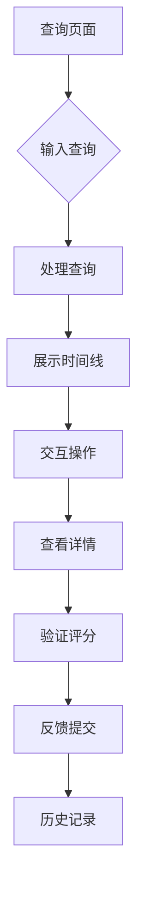

## 1. 产品概述

TS端到端时间线交互工具，提供单输入框查询界面，Fastify后端只读工具与评分验证功能。用户通过自然语言输入查询，系统返回可视化时间线结果并支持交互操作。

## 2. 核心功能

### 2.1 用户角色

| 角色   | 注册方式 | 核心权限           |
| ---- | ---- | -------------- |
| 访客用户 | 无需注册 | 使用查询功能，查看时间线结果 |
| 注册用户 | 邮箱注册 | 保存查询历史，收藏时间线   |

### 2.2 功能模块

核心页面包括：

1. **查询页面**：单输入框查询，时间线展示，交互操作
2. **结果页面**：详细时间线，数据验证，评分反馈
3. **历史页面**：查询记录，收藏管理

### 2.3 页面详情

| 页面名称 | 模块名称  | 功能描述               |
| ---- | ----- | ------------------ |
| 查询页面 | 输入模块  | 支持自然语言输入，智能提示，查询提交 |
| 查询页面 | 时间线模块 | 可视化时间轴，节点交互，缩放平移   |
| 查询页面 | 工具栏   | 导出数据，分享链接，刷新结果     |
| 结果页面 | 详情面板  | 显示节点详细信息，数据来源      |
| 结果页面 | 验证模块  | 数据准确性验证，置信度评分      |
| 结果页面 | 反馈模块  | 用户评分，错误报告，改进建议     |
| 历史页面 | 记录列表  | 查询历史时间倒序排列         |
| 历史页面 | 收藏管理  | 收藏/取消收藏，标签分类       |

## 3. 核心流程

用户操作流程：

1. 用户在查询页面输入自然语言查询
2. 系统处理查询并返回时间线数据
3. 用户可交互操作时间线（点击、缩放、平移）
4. 查看节点详情和验证信息
5. 提供评分反馈

## 4. 用户界面设计

### 4.1 设计风格

* 主色调：蓝色系（#2563eb, #3b82f6）

* 辅助色：灰色系（#6b7280, #9ca3af）

* 按钮样式：圆角矩形，悬停效果

* 字体：系统默认字体，标题16px，正文14px

* 布局：卡片式布局，响应式设计

* 图标：简约线性图标风格

### 4.2 页面设计概览

| 页面名称 | 模块名称 | UI元素              |
| ---- | ---- | ----------------- |
| 查询页面 | 输入模块 | 大尺寸输入框，占位符提示，搜索按钮 |
| 查询页面 | 时间线  | 水平时间轴，节点圆圈，连接线    |
| 查询页面 | 工具栏  | 图标按钮组，下拉菜单        |
| 结果页面 | 详情面板 | 侧边抽屉，层级信息展示       |
| 结果页面 | 验证模块 | 星级评分，置信度条，验证标签    |
| 历史页面 | 记录列表 | 时间线卡片，操作按钮组       |

### 4.3 响应式设计

桌面优先设计，适配移动端：

* 桌面端：完整功能布局

* 平板端：优化时间线显示

* 手机端：简化界面，手势操作

### 4.4 交互指导

* 时间线支持鼠标滚轮缩放

* 节点点击展开详细信息

* 拖拽平移时间线视图

* 键盘

