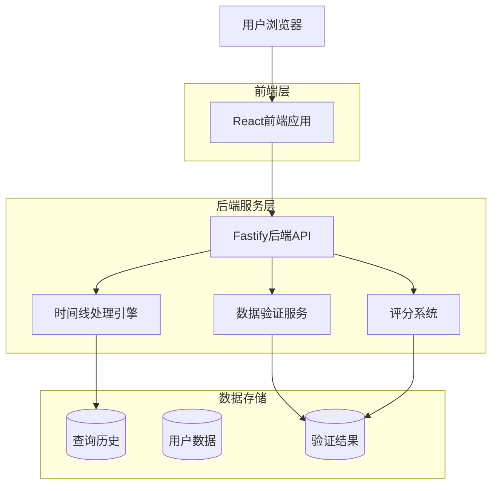
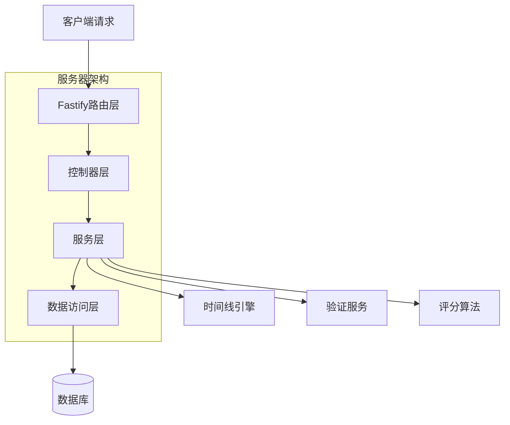
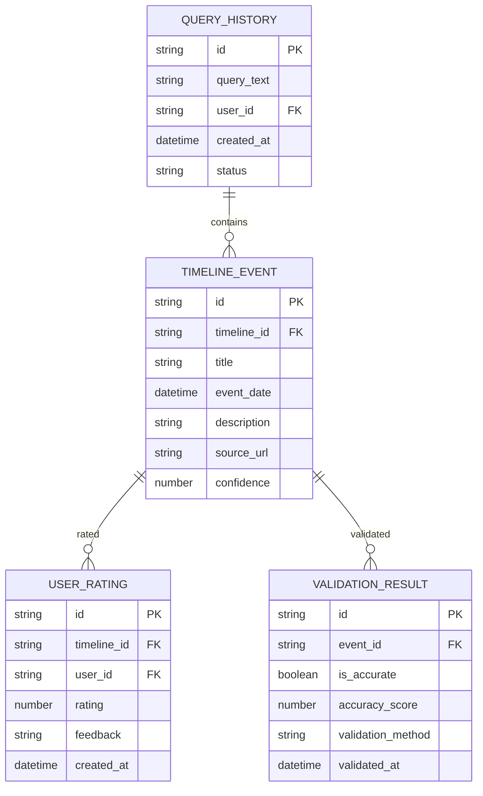

## 1. 架构设计



## 2. 技术描述

- 前端：React@18 + TypeScript@5 + TailwindCSS@3 + Vite
- 初始化工具：vite-init
- 后端：Fastify@4 + TypeScript@5
- 数据库：SQLite（开发）/ PostgreSQL（生产）

核心依赖：
- 前端：react-router-dom, axios, date-fns, lucide-react
- 后端：@fastify/cors, @fastify/helmet, zod
- 时间线：vis-timeline（可视化）

## 3. 路由定义

| 路由 | 用途 |
|------|------|
| / | 查询主页，单输入框界面 |
| /timeline/:id | 时间线详情页，展示结果 |
| /history | 查询历史记录页面 |
| /api/query | 查询处理API端点 |
| /api/validate | 数据验证API端点 |
| /api/rate | 评分提交API端点 |

## 4. API定义

### 4.1 核心API

**查询处理**
```
POST /api/query
```

请求：
| 参数名 | 参数类型 | 是否必需 | 描述 |
|--------|----------|----------|------|
| query | string | true | 自然语言查询文本 |
| userId | string | false | 用户ID（可选） |

响应：
| 参数名 | 参数类型 | 描述 |
|--------|----------|------|
| timelineId | string | 时间线唯一标识 |
| events | array | 时间线事件数组 |
| confidence | number | 结果置信度分数 |

示例：
```json
{
  "query": "苹果公司历年重要产品发布",
  "userId": "user123"
}
```

**数据验证**
```
POST /api/validate
```

请求：
| 参数名 | 参数类型 | 是否必需 | 描述 |
|--------|----------|----------|------|
| timelineId | string | true | 时间线ID |
| eventIds | array | true | 需要验证的事件ID数组 |

响应：
| 参数名 | 参数类型 | 描述 |
|--------|----------|------|
| validation | object | 验证结果详情 |
| accuracy | number | 准确性评分 |

**评分提交**
```
POST /api/rate
```

请求：
| 参数名 | 参数类型 | 是否必需 | 描述 |
|--------|----------|----------|------|
| timelineId | string | true | 时间线ID |
| rating | number | true | 用户评分（1-5） |
| feedback | string | false | 文字反馈 |

## 5. 服务器架构图



## 6. 数据模型

### 6.1 数据模型定义



### 6.2 数据定义语言

**查询历史表**
```sql
CREATE TABLE query_history (
    id TEXT PRIMARY KEY,
    query_text TEXT NOT NULL,
    user_id TEXT,
    created_at DATETIME DEFAULT CURRENT_TIMESTAMP,
    status TEXT DEFAULT 'pending'
);

CREATE INDEX idx_query_history_user_id ON query_history(user_id);
CREATE INDEX idx_query_history_created_at ON query_history(created_at DESC);
```

**时间线事件表**
```sql
CREATE TABLE timeline_events (
    id TEXT PRIMARY KEY,
    timeline_id TEXT NOT NULL,
    title TEXT NOT NULL,
    event_date DATETIME NOT NULL,
    description TEXT,
    source_url TEXT,
    confidence REAL DEFAULT 0.0,
    FOREIGN KEY (timeline_id) REFERENCES query_history(id)
);

CREATE INDEX idx_timeline_events_timeline_id ON timeline_events(timeline_id);
CREATE INDEX idx_timeline_events_date ON timeline_events(event_date);
```

**用户评分表**
```sql
CREATE TABLE user_ratings (
    id TEXT PRIMARY KEY,
    timeline_id TEXT NOT NULL,
    user_id TEXT NOT NULL,
    rating INTEGER CHECK (rating >= 1 AND rating <= 5),
    feedback TEXT,
    created_at DATETIME DEFAULT CURRENT_TIMESTAMP,
    FOREIGN KEY (timeline_id) REFERENCES query_history(id)
);

CREATE INDEX idx_user_ratings_timeline_id ON user_ratings(timeline_id);
```

**验证结果表**
```sql
CREATE TABLE validation_results (
    id TEXT PRIMARY KEY,
    event_id TEXT NOT NULL,
    is_accurate BOOLEAN,
    accuracy_score REAL,
    validation_method TEXT,
    validated_at DATETIME DEFAULT CURRENT_TIMESTAMP,
    FOREIGN KEY (event_id) REFERENCES timeline_events(id)
);

CREATE INDEX idx_validation_results_event_id ON validation_results(event_id);
```

**初始数据**
```sql
-- 插入示例查询
INSERT INTO query_history (id, query_text, user_id, status) VALUES 
('demo001', '苹果公司历年重要产品发布', 'guest', 'completed');

-- 插入示例事件
INSERT INTO timeline_events (id, timeline_id, title, event_date, description, source_url, confidence) VALUES
('event001', 'demo001', 'iPhone发布', '2007-01-09', '史蒂夫·乔布斯发布第一代iPhone', 'https://apple.com', 0.95),
('event002', 'demo001', 'iPad发布', '2010-01-27', '苹果公司发布平板电脑iPad', 'https://apple.com', 0.92);
```