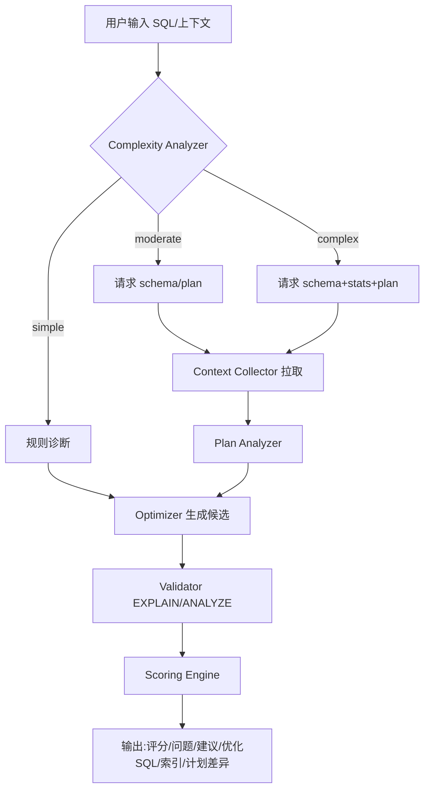
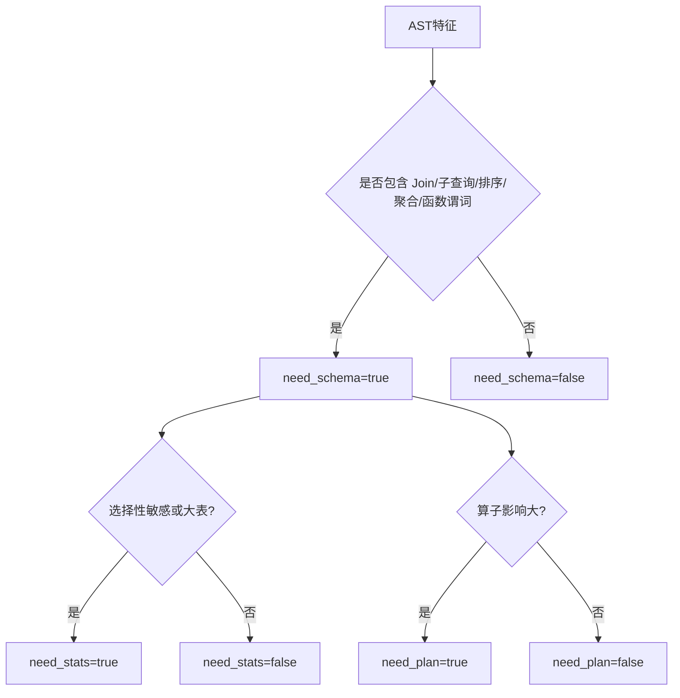
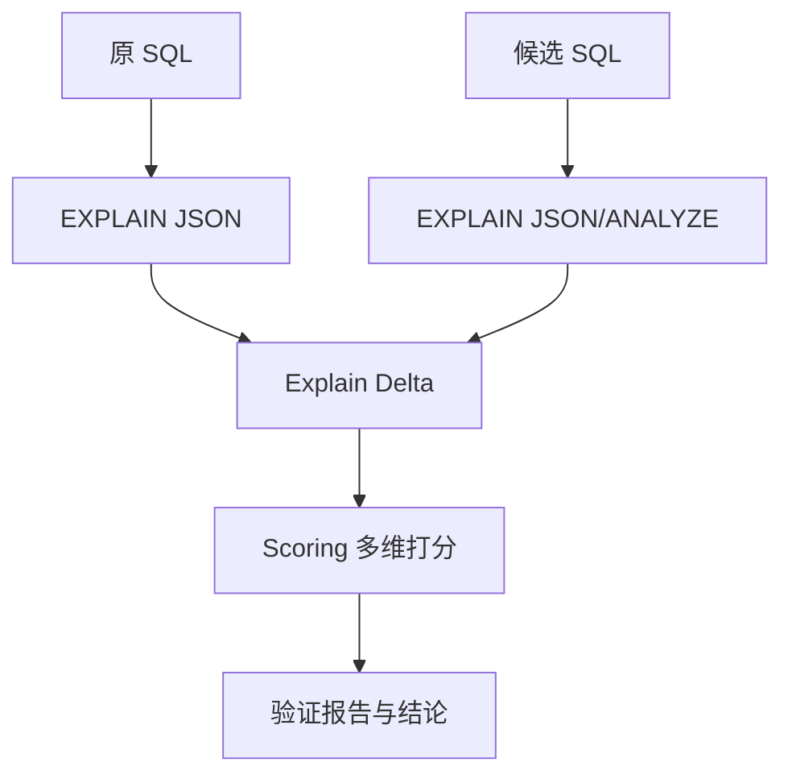
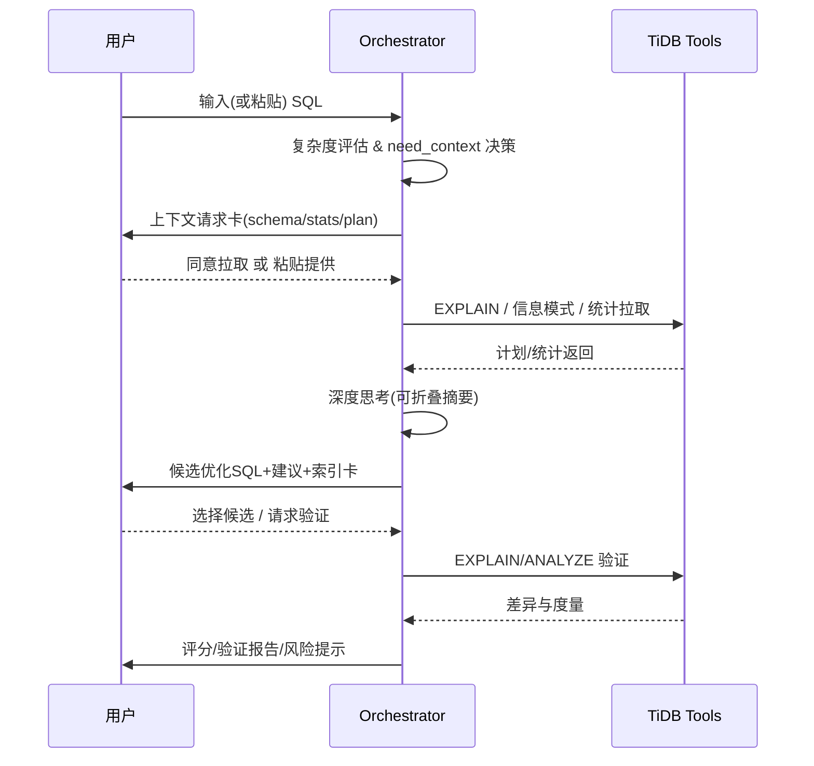

# SQLFlash：AI Agent 驱动的 TiDB SQL 优化工具

> 借鉴 Claude Code 的多智能体协作、自我反思与可验证循环理念，基于用户 SQL 自动决策是否需要表结构、统计信息与执行计划，并输出评分、问题、优化建议与优化 SQL。

## 1. 总体目标
- 根据输入 SQL 自动判断复杂度与所需上下文，给出可解释的诊断与改写方案。
- 通过 EXPLAIN/ANALYZE 对比与规则库实现“验证闭环”，保证优化具有可证据的收益。
- 只读、安全、可控：不执行写入语句；最小权限与限流；脱敏日志。

## 2. 系统架构与组件
- **Orchestrator Agent**：编排任务与工具调用，维持上下文与记忆。
- **Complexity Analyzer**：基于 AST/启发式评估复杂度并给出 `need_context` 决策。
- **Context Collector**：拉取/接收 `schema/stats/plan`（TiDB 只读连接）。
- **Plan Analyzer**：解析 EXPLAIN(JSON/ANALYZE) 抽取算子、估算行数与瓶颈。
- **Optimizer Agent**：结合规则与 LLM 生成候选优化 SQL 与索引建议。
- **Validator**：用真实计划/估算对比候选方案，生成验证报告。
- **Scoring Engine**：从代价、资源、可维护性、可执行性、鲁棒性维度打分。
- **Index Advisor**：访问模式驱动的联合索引/统计建议与收益预测。
- **Explain Delta Builder**：原/新计划差异与收益估计。
- **Safety Layer & Memory**：只读、安全、缓存与上下文压缩。

## 3. 数据流（总体编排）


## 4. 上下文决策


## 5. 验证与评分


### 评分维度（0–100）
- 代价下降（40）：`estRows`、算子代价、扫描范围。
- 资源优化（20）：内存/磁盘/网络减少。
- 可维护性（15）：语义清晰、可读性、风险低。
- 可执行性（15）：运维工作量与副作用低。
- 鲁棒性（10）：统计波动下的稳定性。

## 6. 输入与输出
- 输入：`sql[]`（≤5 并发）、可选 `schema/stats/plan/exec_info`。
- 输出字段：
  - `complexity_level`：`simple | moderate | complex`
  - `need_context`：`{schema, stats, plan}`
  - `diagnostics`：问题列表与定位
  - `suggestions`：优化建议与理由
  - `sql_optimized`：候选优化 SQL（多版本可选）
  - `score`：总分与分项分
  - `explain_delta`：原/新计划差异与收益估计
  - `index_advice`：索引与统计建议
  - `validation_report`：验证结论
  - `ops_hint`、`risk_notes`

## 7. 复杂度评估策略
- 语法特征：子查询层数、窗口、聚合、CTE/UNION、表达式复杂度。
- 数据访问：Join 数量/类型、谓词选择性、函数对索引可用性影响。
- 资源推测：大表扫描概率、锁风险、更新/删除写路径。
- 分档：`simple`（轻建议）/`moderate`（schema+plan）/`complex`（schema+stats+plan）。

## 8. 优化规则库（示例）
- 谓词：`LIKE '%x'` → 前缀索引不可用，建议倒排/表达式索引/改写。
- 函数包裹列：考虑可计算列/函数索引或等价范围化。
- 大量 `OR`：改写 `UNION ALL` 或 `IN`（评估去重）。
- 子查询/反连接：`NOT EXISTS` ↔ `LEFT JOIN ... IS NULL` 语义与索引评估。
- 聚合与排序：覆盖索引、减少列宽、`ORDER BY + LIMIT` 的复合索引。
- 统计：过期→`ANALYZE`；高基数列直方图；计划绑定风险与时效。
- TiDB 特性：TiFlash列存/MPP、下推与裁剪、并发与 chunk 参数。

## 9. 执行计划分析（TiDB）
- 关注算子：`Table/IndexScan`、`IndexLookup`、`HashJoin`、`Sort/TopN`、`Agg`、`Exchange*`、`BatchCop`。
- 关键指标：`task`、`estRows` vs `actRows`、`memory/disk`、是否下推、并行度。
- 诊断：估算偏差→统计问题；`root` 层算子过多→下推不足；Join 顺序不佳→选择性与索引建议。

## 10. LLM 提示与自我反思链
- `analysis_prompt`：基于 AST 与上下文识别问题与所需信息。
- `rewrite_prompt`：生成候选 SQL 与 rationale。
- `critique_prompt`：自我批判与风险标注。
- `verify_prompt`：结合计划差异与规则库输出验证结论。

## 11. API 草图
```json
POST /optimize
{
  "sql": ["..."],
  "schema": {},
  "stats": {},
  "explain": {}
}
```

## 12. AI Native 交互设计
- 单输入框：页面仅保留一个 SQL 输入框（支持多条、粘贴示例、历史检索）。
- 思考时间线：所有分析与工具调用以时间线气泡呈现，可折叠“深度思考摘要”。
- 智能请求卡：系统根据复杂度自动提出“需要的上下文”（schema/stats/plan），用户可选择“同意拉取（只读）”或“粘贴提供”。
- 执行步骤面板：每次工具调用都会生成一步骤卡（如 `EXPLAIN FORMAT=JSON`、统计获取），展示摘要与原始结果切换。
- 建议确认：对索引/统计更新/计划绑定等动作以确认卡呈现，默认不执行，仅在用户同意后进入验证环节。
- 结果汇总：在时间线末尾输出评分、问题诊断、优化建议、优化后的 SQL、索引建议、计划差异与收益估计。
- 验证闭环：用户点“验证”后触发 EXPLAIN/ANALYZE 对比，输出验证报告与风险提示。
- 安全指示：状态栏显示“只读连接/限流/脱敏启用”，所有潜在变更均需确认。



### 交互准则
- 默认轻量输出，可展开查看详细过程与原始数据。
- 所有“可能改变执行或元数据”的动作需二次确认与风险标注。
- 时间线可回溯与复用上下文；历史任务可一键复跑。

## 13. 示例策略：NOT EXISTS 学生与课程
- 复杂度：`moderate`。
- 需要：`schema + plan`；若两列均有高选择性索引，保留 `NOT EXISTS`；否则评估 `LEFT JOIN IS NULL`。
- 索引：`students(student_id)`、`student_classes(student_id)`；必要时联合索引。
- 验证：两版 `EXPLAIN JSON` 对比 `IndexLookupJoin` 命中与回表次数。

---
**附注**：本文档由 `Marked + Mermaid` 渲染，无需构建即可预览；运行 `npm run docs:dev` 启动本地预览。
